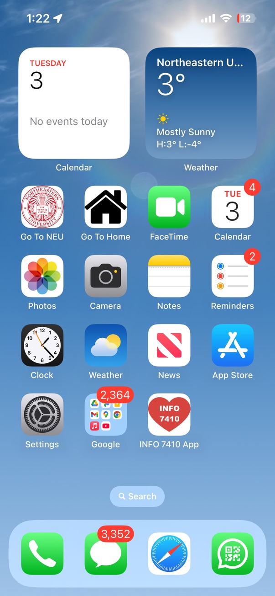
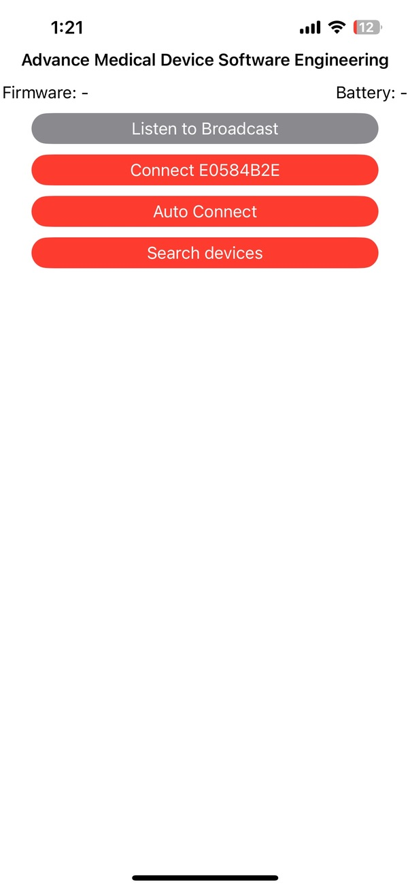
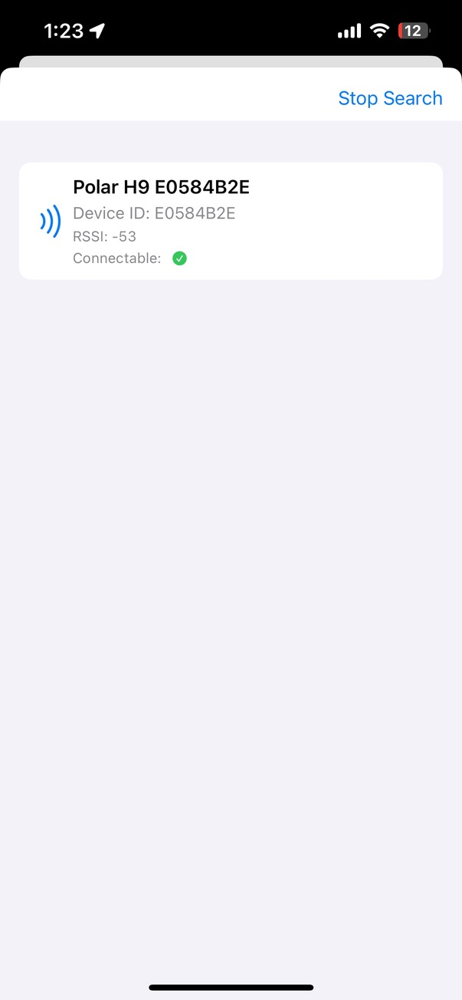
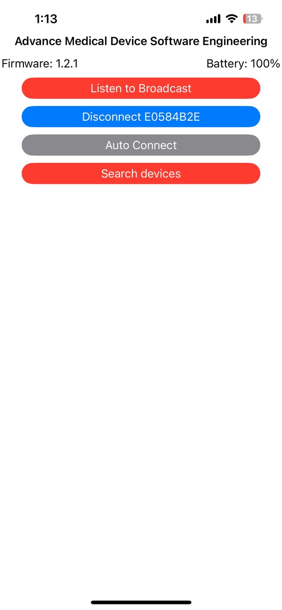
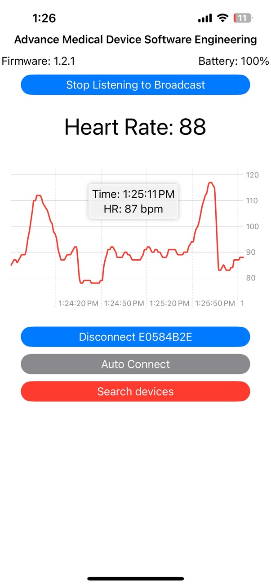
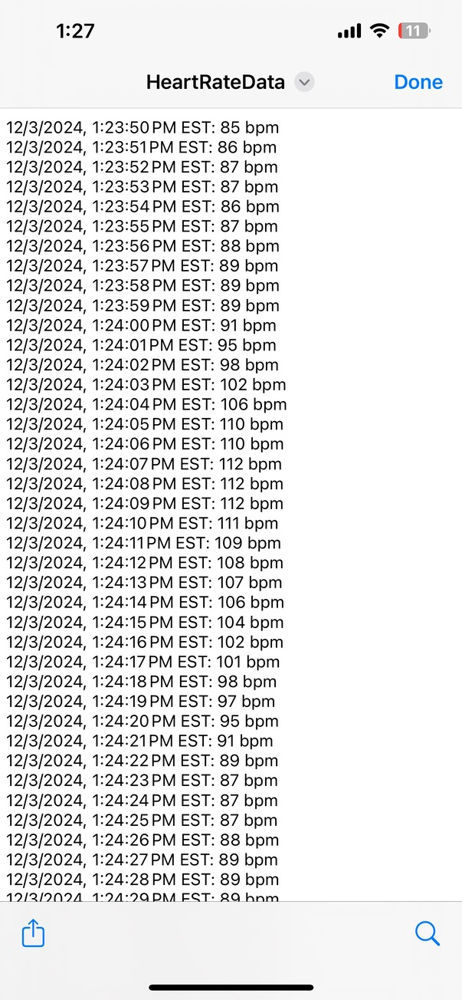

# Heart Rate Monitor iOS App

A simple iOS application for real-time heart rate monitoring using the Polar H9 sensor.

## Overview
This project is an iOS application that connects to the **Polar H9** heart rate sensor and displays real-time heart rate data. The app provides a minimal yet functional alternative to the **Polar Flow** app, allowing users to track their heart rate efficiently.

## Features
**Real-time Heart Rate Monitoring** - Connects to the Polar H9 sensor and displays real-time BPM.

**Bluetooth Low Energy (BLE) Connectivity** - Uses CoreBluetooth framework to establish communication.

**Start/Stop Monitoring** - Users can control when to start or stop listening to heart rate data.

**Simple UI** - A lightweight and user-friendly interface focused on heart rate display.

## Getting Started
### Prerequisites
- **Xcode** (Latest Version)
- **iOS 15+**
- **Swift 5**
- **Polar H9 Heart Rate Sensor**
- **CocoaPods Installed** (`sudo gem install cocoapods`)

### Installation
1. Install CocoaPods if not already installed:
   ```sh
   sudo gem install cocoapods
   ```
2. Clone this repository:
   ```sh
   git clone https://github.com/OmkumarSolanki/heart-rate-app
   cd heart-rate-app
   ```
3. Navigate to your project directory:
   ```sh
   cd /Project_Path/
   ```
4. Install dependencies using CocoaPods:
   ```sh
   pod install
   ```
5. Initialize CocoaPods:
   ```sh
   pod init
   ```
6. Open `HeartRateMonitor.xcodeproj` in Xcode.
7. Connect your iPhone via USB or use an iOS simulator.
8. Build and run the project.

## Technologies Used
- **Swift 5** - Primary language for development.
- **CoreBluetooth** - Framework for Bluetooth communication.
- **UIKit** - Standard UI framework for iOS.

## Screenshots

#### Phone Home Screen


#### Home Screen


#### Search Device


#### Device Connected


#### Start Listening to device


#### HeartRateData.txt file


## Known Issues
- **Connection Stability** - BLE connection sometimes drops unexpectedly.

## IEC 62304 Compliance
This application follows the **IEC 62304** standard for medical device software lifecycle processes. The development process adheres to:
- **Software Development Planning** ensuring traceability and risk management.
- **Software Requirements Analysis** defining software requirements to meet user and regulatory needs.
- **Software Architectural Design** establishing system components and their interactions.
- **Software Detailed Design** providing in-depth specifications for each component.
- **Software Unit Implementation and Verification** ensuring correctness at the modular level.
- **Software Integration and Integration Testing** validating interactions between modules.
- **Software System Testing** verifying the overall system functionality.
- **Software Release** ensuring all compliance and quality checks are met before deployment.
- **Software Configuration Management** maintaining controlled versions and documentation.
- **Software Problem Resolution** addressing and resolving defects to enhance reliability.


## Contact
Created by **Omkumar Dhirenbhai Solanki**  
📩 solanki.o@northeastern.edu 
🔗 [LinkedIn Profile](https://www.linkedin.com/in/omsolanki/)  

---
